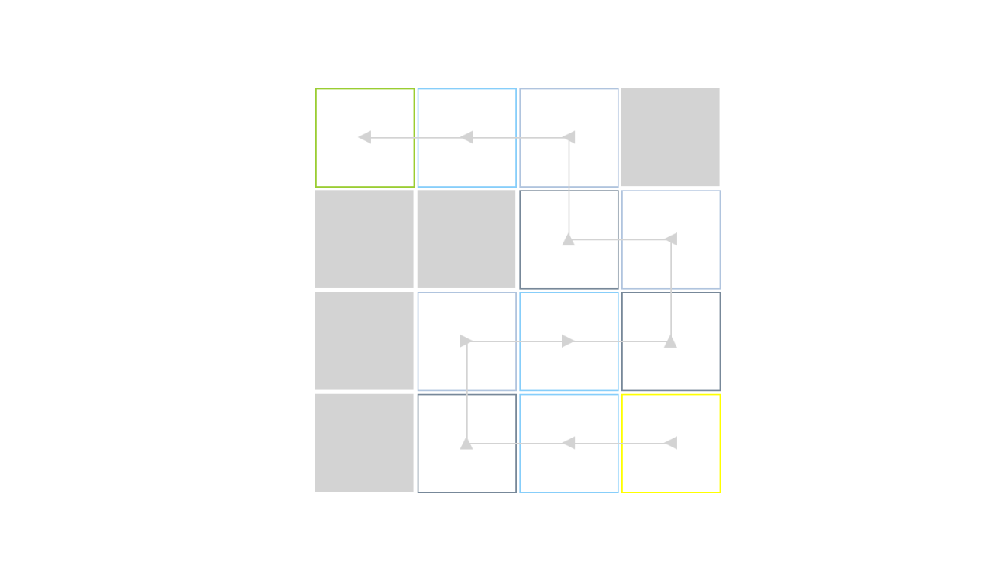

# Random Cave

A prototype for Generating Random Cave-Like Levels. [See the demo](https://aitorfernandez.github.io/random-cave/)

  

## How works

_On a grid the 4x4_

1. Choose random left or right direction starting in the bottom row.

2. Place a start room and continue straight forward the path until it hits the last element of the grid in the current row or gets a random number between 0 and 5.

3. On a random number 5 or hitting the edge of the grid the path goes up.
  - If not hits the edge of the grid the next rooms in the current row are no-path rooms types until the edge of the grid.

  - It hits the edge of the grid continue in the opposite direction with the next row.

  - If random number 5, random left or right direction in the next row.

4. Straight forward again until random number 5 or edge of the grid.

5. Repeat 3 and 4 steps.

6. In the top row instead, go up, we place the exit room.

## Rooms

* room 0 - A start room
* room 1 - A room that is guaranteed to have a left exit and a right exit
* room 2 - A room that is guaranteed to have exits on the left, right, and top
* room 3 - A room that is guaranteed to have exists on the left, right, and bottom
* room 4 - A room that is not part of the path
* room 5 - A exit room
